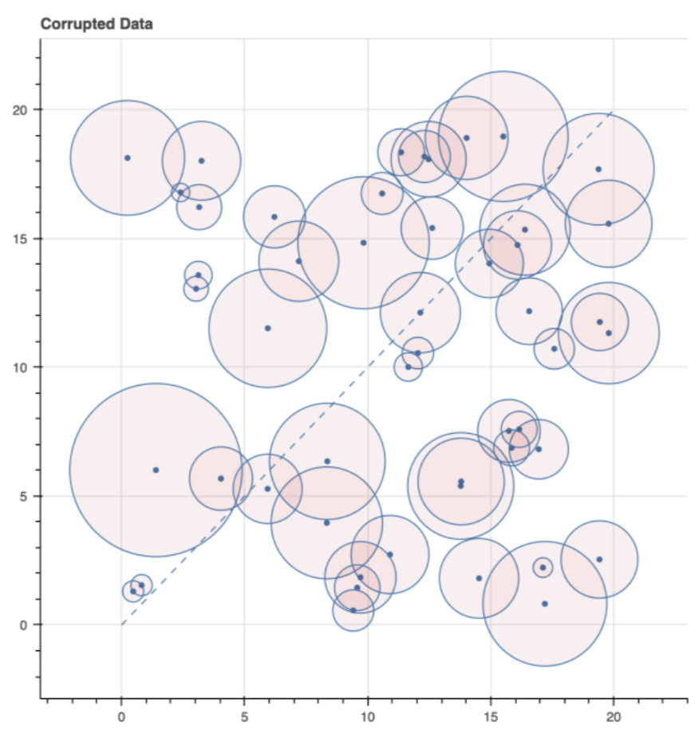

# Antarctica

## Assignment

### Background

Professor Randall McNaughton, a climate scientist, went to Antarctica to place a number of
climate probes in the ice at random locations in a 20 mile by 20 mile grid. He recorded the
positions in this x-y grid using a highly accurate GPS-powered device of his creation. The radio
probes also record (among other things) the distance to the nearest probe along with an error
estimate of that distance (estimated 1 standard deviation) which is reported to the Professor’s
lab, in the US, via radio, once per day.

These probes will be picked up again in three years, and positions measured more accurately,
in order to track any movement of the ice which is expected to be no more than a few
meters/year.

The Professor recorded the data: index, x, y, min_dist, min_dist_err in his notebook after placing
each. After arriving back in the United States he discovered, to his horror, that the x, y
coordinates do not agree with the probe distance measurements within expected errors. He
then discovered that his device is flawed and that the x, y coordinates switch places depending
on whether the device is pointing North or South. Since he has no idea which direction he was
facing, he doesn’t actually know which coordinate is which. Each probe could be in one of two
places. The distance measurements are however still correct. This data corruption complicates
the recovery process and the scientific analysis and has him very worried.

### Problem

How much information can we recover about the x, y coordinates simply from the initial distance
measurements? Try to reconstruct the true x, y positions as well as you can so that the recovery
crew can minimize the time they spend digging up the probes.

The plot below shows a scatter plot of the corrupted x, y points with circles of radius min_dist.
Notice how some pairs of points do indeed differ in distance by about the same radius of their
closest-point circles. Some do not.

<center></center>

### Instructions

Produce a file which has corrected the corruption as best you can. How many holes do you
estimate they need to dig to recover all 50 probes? Also send us your code, an explanation of
what it is doing, and instructions for running it.

## Getting Started

### Prerequisites

* Python 3.12
* UV

### Configure Environment

The following should work from either Bash or ZSH.

```shell
# Configure environment
source environment.sh
make

# Activate venv
source .venv/bin/activate

# Launch jupyter
jupyter lab
```

## Notebooks

The following 3 notebooks walk through my analysis from beginning to end. My final "solution" can be found in the
Summary section of the last notebook.

* [Exploratory Data Analysis](notebooks/01-eda.ipynb)
* [Neighbor Graphs](notebooks/02-neighbor-graphs.ipynb)
* [Probe Clusters](notebooks/03-probe-clusters.ipynb)

## Source Code

The analysis in the notebooks required a number of utility functions for manipulating the data. Most of this code
is implemented in `src/antarctica` and verified with tests in `tests/unit`.